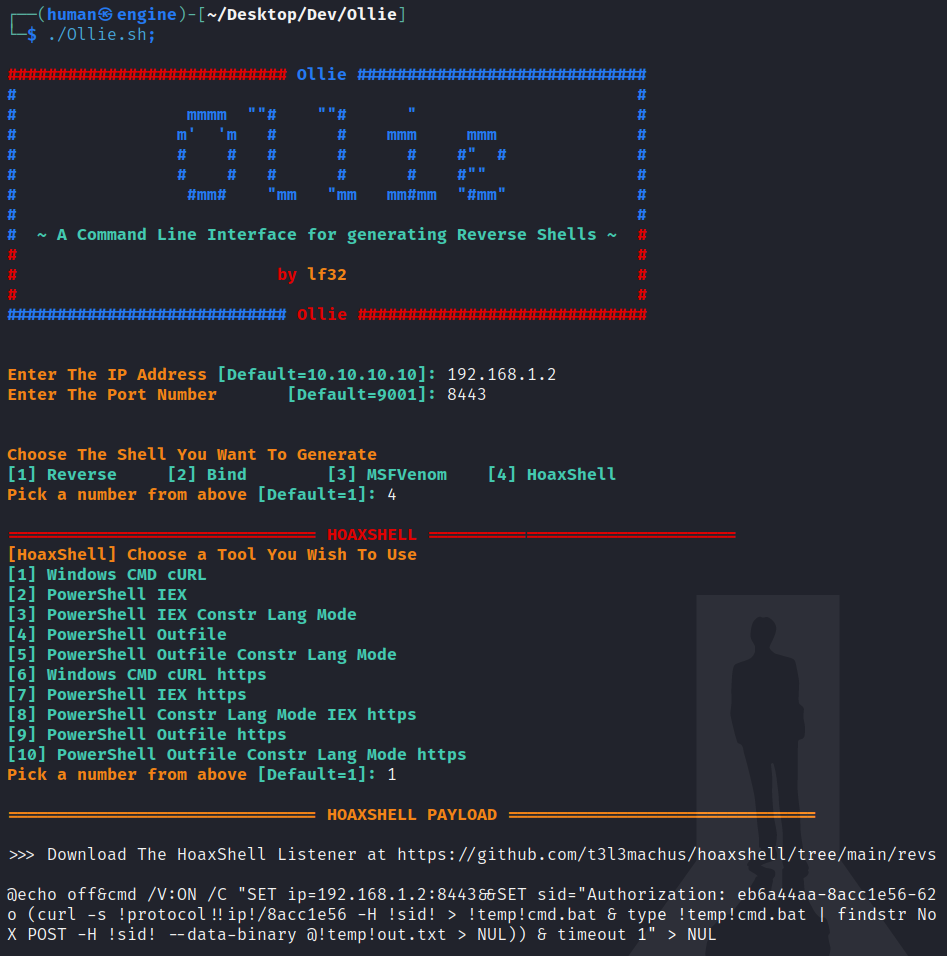

# Ollie


#### A Command Line Interface for generating Reverse Shells

This project was inspired from [revshells.com](https://revshells.com).

## Features

The above script supports generating payloads for

+ Reverse Shells
+ Bind Shells
+ MSFVenom
+ HoaxShell

Supporting all the 3 platforms
~
+ Linux
+ Windows
+ Mac

Encoding Reverse Shell Payloads is also supported, basic encodings supported are 

+ URL Encoding
+ Double URL Encoding
+ Base64 Encoding


## Installation

To install the script you can either download the file using curl 

```
curl -sO https://raw.githubusercontent.com/lf32/Ollie/main/Ollie.sh
```

Convert the downloaded `Ollie.sh` to an executable.

```
chmod +x Ollie.sh
```

Since the script uses Bash Shell to run you can simply execute it with

```
./Ollie.sh
```

The following script helps in generating reverse shell payloads directly from your terminal.



## License

This Project is licensed under MIT by [lf32](https://github.com/lf32).
